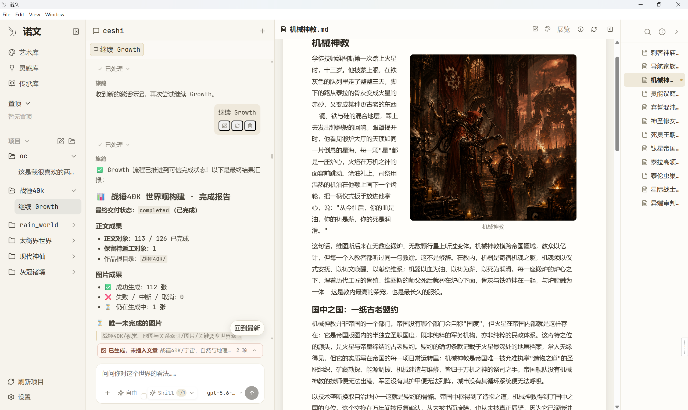
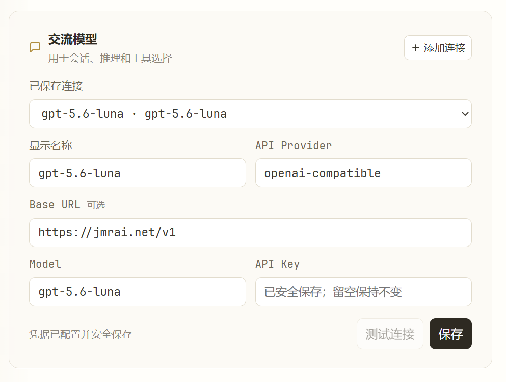
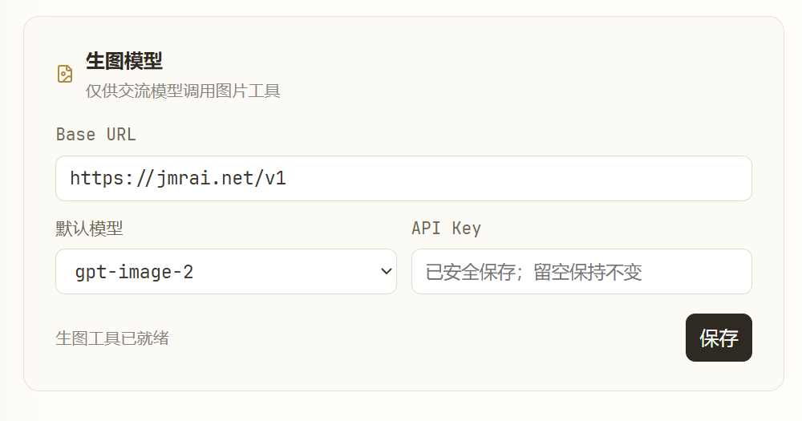
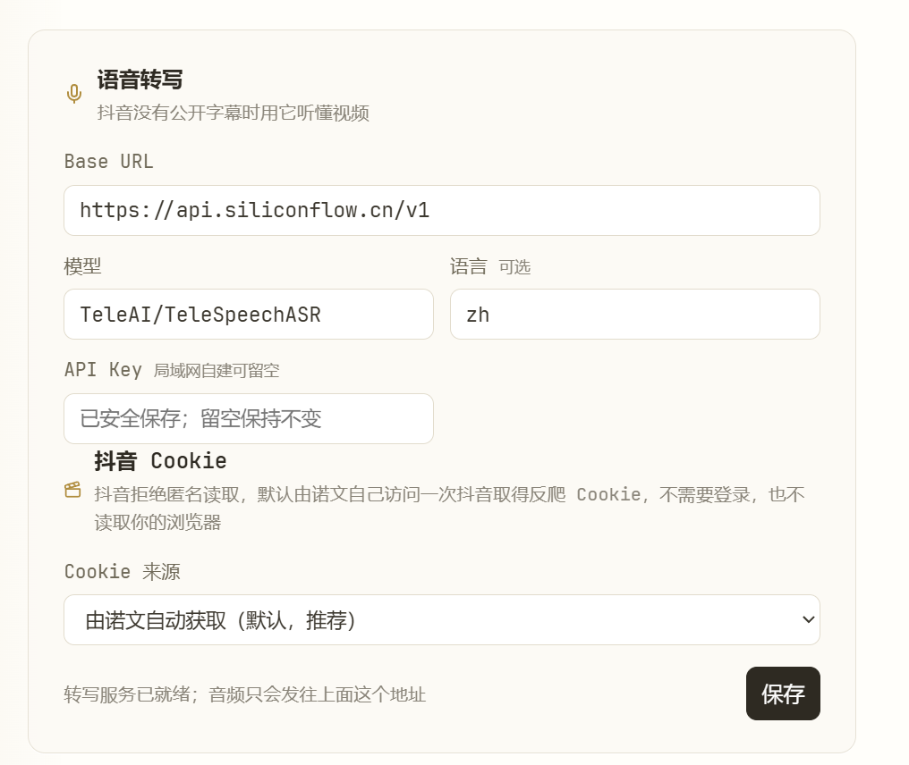
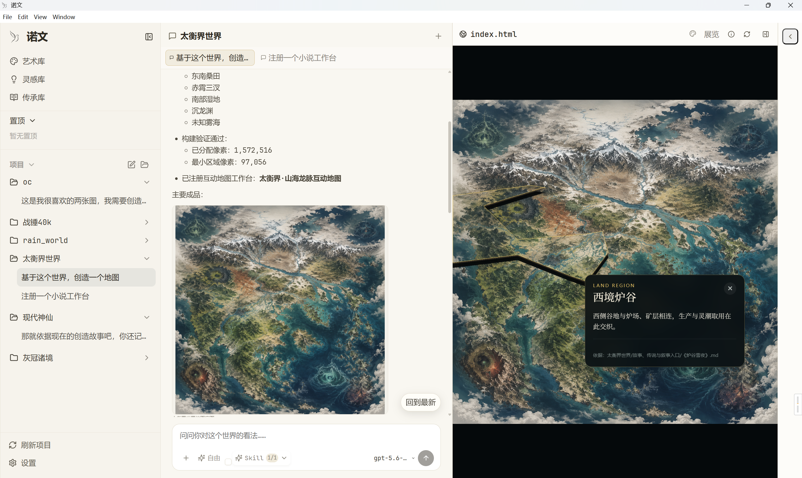
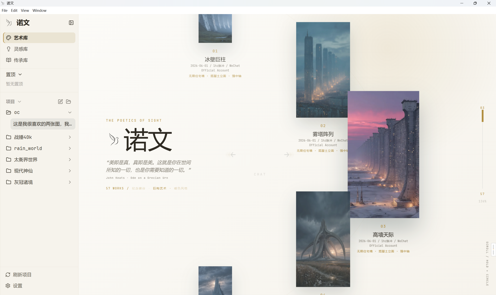
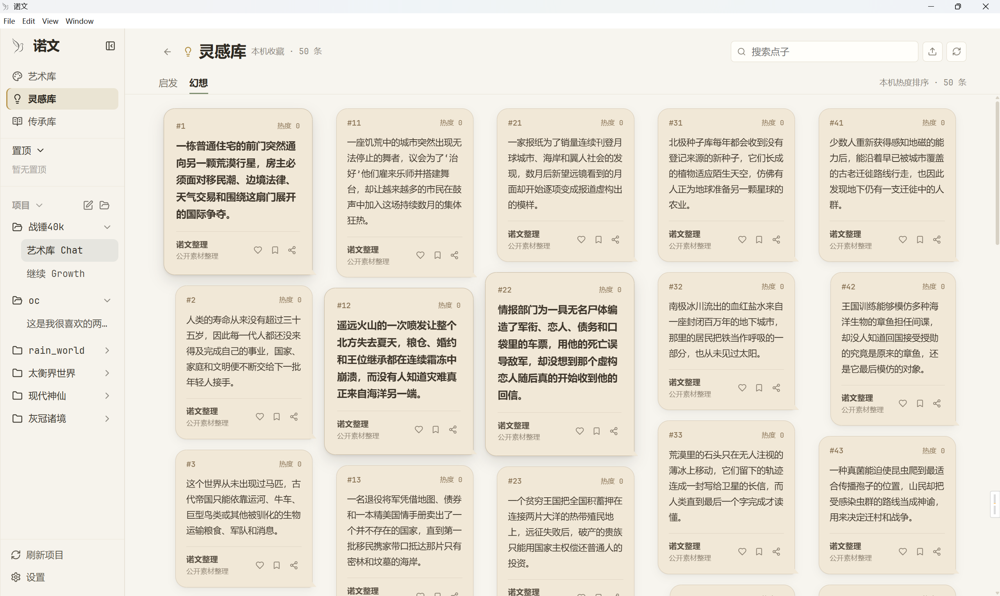
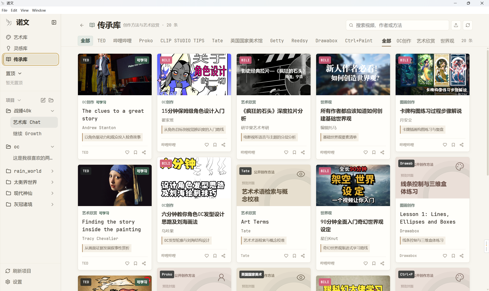

<p align="center">
  
</p>

<h1 align="center">诺文 Noven</h1>

<p align="center"><strong>把打动你的每一条视频，变成一颗世界的种子。</strong></p>
<p align="center">从视频到文字，从文字到世界观、角色、故事与图像。AI 干手艺活，你当导演。</p>

<p align="center">
  <a href="https://github.com/ccbili30-collab/noven/releases">下载 Windows 版本</a> ·
  <a href="#第一次使用">第一次使用</a> ·
  <a href="#从一条视频到一个世界">完整创作流程</a> ·
  <a href="#ai-工具箱">AI 工具箱</a>
</p>



## 一条好视频，除了被看完，还能成为什么？

在信息流里，我们每天都会刷过有惊喜、有收获、有共鸣的内容。它们被点赞、被收藏，然后渐渐被遗忘。

诺文想重构这段关系：你只需要交给它一条打动自己的视频，或者一段文字、一个点子、一张图片，再说出自己的创作愿望。诺文会读取内容、提炼主题与意象，把它凝结成一颗“创作种子”；在与你确认方向后，这颗种子会继续生长为世界设定、人物角色、地点、事件、故事、地图和图像。

所有成果都会成为项目中的真实文件。它们不是一次性回答，也不会被关在不可见的黑盒里：你可以打开、修改、整理、带走，再让 AI 依据你的修改继续创作。

> **诺文不是替你决定作品，而是让内容消费的终点成为创作的起点。**

## 30 秒理解诺文

```text
一条打动你的视频 / 图片 / 文章 / 点子
                    ↓
         提炼主题、情绪、意象与矛盾
                    ↓
              形成“创作种子”
                    ↓
              用户确认创作方向
                    ↓
      世界观 · 人物 · 地点 · 事件 · 故事 · 图像
                    ↓
          真实文件 + 可继续生长的工作台
```

## 第一次使用

### 1. 下载与安装

从 [Releases（发布页）](https://github.com/ccbili30-collab/noven/releases) 下载最新的 Windows x64 安装包并完成安装。

首次启动时，诺文会自动播放十步新手引导。你可以随时跳过；以后也可以从左下角重新播放。

### 2. 准备 API 配置

诺文需要模型服务完成对话、视频转写和图片生成。比赛体验时，请使用现场提供的以下信息：

- Base URL（服务地址）
- API Key（接口密钥）
- Model（模型名称）
- Provider（接口类型，如现场要求填写）

> 下方截图中的地址和模型名称仅用于说明字段位置。实际体验时请填写比赛现场提供的值，不要照抄截图，也不要在截图、项目文件或公开聊天中展示 API Key。

点击左下角 **设置**，按照需要配置以下三组服务。

#### 2.1 交流模型

交流模型负责理解你的要求、与你确认方向、调用工具并持续创作。

1. 点击 **添加连接**。
2. 填写显示名称、接口类型、Base URL、Model 和 API Key。
3. 点击 **保存**。
4. 如果现场提供连接测试功能，可先测试成功再继续。

<p align="center">
  
</p>

#### 2.2 生图模型

生图模型负责角色立绘、世界地图、场景图和其他视觉作品。不需要生成图片时可以暂不配置。

1. 填写图片服务的 Base URL。
2. 选择现场提供的图片模型。
3. 填写 API Key 并保存。

<p align="center">
  
</p>

#### 2.3 视频与语音转写

使用视频作为创作种子前，需要配置语音转写服务。它负责从视频中提取可供 AI 理解的文字。

1. 填写转写服务的 Base URL、模型、语言和 API Key。
2. 使用抖音链接时，Cookie 来源保持 **由诺文自动获取（默认，推荐）** 即可。
3. 点击 **保存**。

<p align="center">
  
</p>

### 3. 打开项目文件夹

诺文以真实文件夹承载你的作品。建议先在电脑上新建一个空文件夹，例如：

```text
我的科幻世界/
```

回到首页，点击中央的 **打开项目**。如果项目列表为空，该入口可能显示为 **选择已有文件夹**；也可以点击左侧“项目”标题右侧的文件夹图标。随后在系统窗口中选择刚刚创建的文件夹。

此后生成的设定、人物、故事、图片和工作台文件都会保存在这里。不要把 API Key 写进项目文件夹。

## 从一条视频到一个世界

### 第 1 步：创建新会话

点击左侧“项目”标题右侧的笔形按钮，或者聊天区右上角的 **新会话**。会话会与当前项目文件夹关联。

### 第 2 步：种下内容种子

你可以：

- 把抖音分享链接粘贴到输入框；
- 将本地视频拖入聊天区；
- 上传图片或文档；
- 直接写下一个点子、一段故事或一个创作问题。

除了内容来源，还要告诉诺文你希望它往什么方向生长。例如：

> 以这条视频为种子，帮我创作一个经典硬科幻世界，并写出其中的第一篇小说。

更具体的要求会带来更明确的方向，例如作品类型、时代、情绪、审美、希望保留或避开的元素。暂时没有想清楚也没关系，诺文会先与你确认。

### 第 3 步：确认 AI 的理解

发送后，诺文会准备来源内容。视频需要经过下载、音频提取和文字转写，因此通常比普通对话更慢。

诺文会先复述它理解到的主题、情绪、核心意象和创作方向。此时你可以：

- 回复“确认”，让它继续；
- 指出理解错误；
- 要求保留某个关键意象；
- 删除你不喜欢的方向；
- 调整题材、尺度、文风或视觉风格。

确认的意义是把导演权留给用户，而不是让 AI 看到素材后直接替你决定作品。

### 第 4 步：看着世界长出来

确认方向后，诺文会逐步创建世界设定、角色、地点、事件、关系、故事结构和视觉作品。首批文件会陆续出现在项目里。

查看成果有两种方式：

1. 点击对话中出现的文件、图片或链接，直接在工作台打开；
2. 点击最右侧 **展开工作台导航**，再通过顶部的工作台切换入口查看文件树和画布。

大型世界属于长流程，不需要一直等待全部结束。你可以先阅读已经出现的文件，并继续提出修改要求。

### 第 5 步：继续当导演

可以直接在会话中继续要求：

```text
写出第一章。
为主角生成一张全身立绘。
画一张这个世界的地图。
把这一段写得更克制，不要解释人物的情绪。
根据我在画布上的批注修改这张图。
检查现有设定之间有没有因果矛盾。
```

文字和图片都会继续进入当前项目，而不是成为与项目无关的一次性回答。

## 工作台：作品真正生长的地方

工作台用于组织、打开、预览和编辑项目中的真实文件。聊天与工作台可以同时存在：左侧与 AI 沟通，中间阅读作品，右侧查看当前工作台的文件结构。



工作台可以承载：

- 小说、设定集和人物档案；
- 图片、角色画廊与风格板；
- 世界地图和可选择区域；
- 因果关系图；
- HTML 交互作品；
- 普通项目文件和文件夹。

工作台只是同一批真实文件的不同视图，不会把作品锁进专用格式。即使离开诺文，你仍然可以用其他软件打开项目文件。

## 三个创作资料库

### 艺术库：保存你的审美

艺术库用于收集、分类和欣赏你真正喜欢的参考图片。新内容先进入候选区，经过你的确认后再成为正式藏品。诺文可以从不同分类中整理风格关键词，供后续作品延续同一套审美。



艺术库不是图片文件管理列表，而是一座属于用户的视觉档案馆。它帮助 AI 理解“你喜欢什么”，但最终是否收入、如何分类仍由用户决定。

### 灵感库：保存值得继续生长的点子

灵感库分为两类：

- **启发**：能够开启思考的问题；
- **幻想**：可以继续发展成世界、情节或作品的完整点子。

你可以搜索、喜欢、收藏和分享，让一闪而过的念头不再消失在信息流里。



### 传承库：收集创作方法与艺术养分

传承库汇集公开的创作方法、艺术欣赏、世界观构建、角色设计与叙事资料。它保留来源，帮助用户和 AI 在创作前学习，而不是把外部内容伪装成原创成果。



## AI 工具箱

普通要求可以直接用自然语言表达；需要明确启动某条创作路线时，也可以使用命令。以下是当前主要能力：

| 能力 | 调用方式 | 适合做什么 |
| --- | --- | --- |
| 小说创作 | 自然语言或 Skill 选择 | 从种子或已有世界建立大纲与小说开篇 |
| 资料研究 | `/study` | 阅读和整理资料，形成可追溯的研究文件 |
| 世界地图 | `/draw-map` | 规划区域并生成视觉地图与可选择地图工作台 |
| 人物群像 | 自然语言或 Skill 选择 | 建立主要人物、普通人物、关系和角色画廊 |
| 连续漫画 | `/draw-comic` | 把已有文本改编成连续分镜与漫画图片 |
| 因果关系网 | `/causality` | 展示世界中已经明确存在的原因与结果关系 |
| 长期目标 | `/growth` | 把一个长期创作目标拆成连续阶段并持续推进 |
| 完整世界 | `/growth_world` | 建立新世界或在尊重原作边界的前提下扩展已有世界 |
| 大型世界工程 | `/growth_world_pro` | 通过分阶段蓝图、审阅和物化生产大型世界项目 |

Skill 不会提升软件权限，也不会绕过用户确认。需要读取文件、执行命令或产生费用的操作，仍受当前会话设置和服务状态约束。

## 一个真实结果是什么样的？

诺文的目标不是生成一段看完即弃的回答，而是留下可以继续编辑的项目：

```text
我的世界/
├── 世界观/
│   ├── 世界规则.md
│   ├── 历史与文明.md
│   └── 技术与信仰.md
├── 人物/
│   ├── 主角.md
│   ├── 对立角色.md
│   └── 角色立绘.png
├── 地点/
├── 事件/
├── 故事/
│   └── 第一章.md
├── 地图/
└── 视觉/
```

具体目录会随作品和你的要求变化，诺文不会强迫所有项目使用同一套模板。

## 常见问题

<details>
<summary><strong>为什么发送视频后没有立即回复？</strong></summary>

视频需要下载、提取音频并转写文字。网络、视频长度和转写服务都会影响等待时间。建议首次体验选择对白清晰、时长适中的视频。

</details>

<details>
<summary><strong>视频中的专有名词会识别错吗？</strong></summary>

可能。背景音乐、口音、歌唱片段和生僻专有名词都会影响转写。涉及人名、作品名和术语时，建议在确认创作方向前主动纠正。转写结果适合作为创作素材，不应未经核对直接当作事实资料引用。

</details>

<details>
<summary><strong>为什么没有生成图片？</strong></summary>

请先检查生图模型是否配置、API Key 是否有效、账户是否有余额，以及图片任务是否仍在队列中。多张图片会依次生成，排队状态不等于失败。

</details>

<details>
<summary><strong>出现临时提示后应该怎么办？</strong></summary>

当前版本如果出现报错，可以点击左下角的 **恢复诺文**，诺文会重启并重新打开软件。短暂网络或会话状态异常也可以先等待提示自行恢复。余额不足、密钥无效、权限拒绝和文件冲突属于真实阻塞问题，需要先解决原因，重启不会替代修复。

</details>

<details>
<summary><strong>生成很久，必须一直等吗？</strong></summary>

不必。大型世界、长篇文本和多张图片属于持续创作流程。你可以先查看已经生成的文件，再继续阅读、修改或提出要求。

</details>

<details>
<summary><strong>我的作品保存在哪里？</strong></summary>

保存在你打开的项目文件夹中。设置、API 凭据和个人服务配置不应写入作品目录，也不应随项目分享。

</details>

## 已知限制

- 视频转写受音质、背景音乐、口音、歌唱内容和专有名词影响，需要用户核对关键内容。
- 当前视频处理可能需要先下载原视频再提取音频，长视频会消耗更多时间与流量。
- 长篇世界深化和多张图片生成需要持续运行，耗时取决于模型服务、网络和任务规模。
- 模型、转写和图片能力依赖用户配置的外部服务；网络不可用、密钥错误、余额不足或服务异常时会失败关闭，不会用本地模板伪装成真实模型结果。
- 不同安装包包含的能力以对应 Release 说明为准。正式展示前建议使用比赛提供的 API 完整预演一次。

## 隐私、文件与创作边界

- **真实文件属于用户**：作品保存在用户选择的项目目录中，可以直接查看和带走。
- **凭据不进入项目**：API Key 属于本机设置，不应写入作品或随项目分享。
- **来源与创作分开**：读取到的来源事实、从来源推导的内容和全新创作内容应保持可区分。
- **用户保留导演权**：关键创作方向先确认，后续可以通过文字要求和视觉批注持续修改。
- **真实错误不会伪装成功**：余额、权限、凭据和文件冲突等阻塞问题会明确保留。

## 我们相信

刷视频不应只是消磨时间。你被打动的每一次，都可以长成一个属于自己的世界——有你的角色、你的故事、你的审美。

**让每一次心动，都变成一次行动。**

---

本项目采用 [MIT License](LICENSE)。
